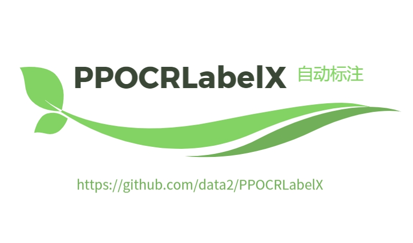

<p align="center">
<p align="center">
<p align="left">
    <a href="./LICENSE"></a>
    <a href=""></a>
    <a href=""></a>
</p>

## 简介

PPOCRLabelX自动标注扩展工具，基于飞桨PPOCRLabel。

<div align="center">
    
</div>

## 快速启动

```shell

pip install -r PPOCRLabelX/PPOCRLabel/requirements.txt
python PPOCRLabelX/PPOCRLabel/PPOCRLabelX.py

```


<a name="许可证书"></a>

## 许可证书
本项目的发布受<a href="https://github.com/data2/PPOCRLabelX/blob/master/LICENSE">Apache 2.0 license</a>许可认证。
